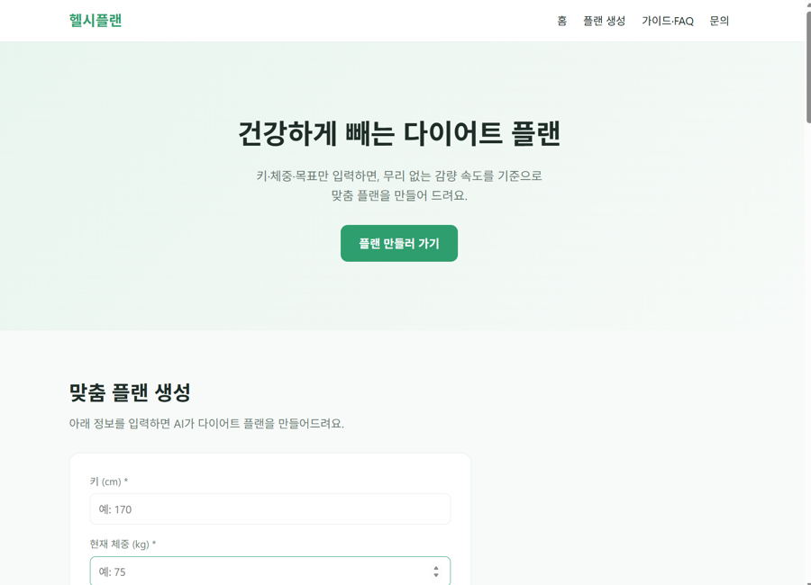
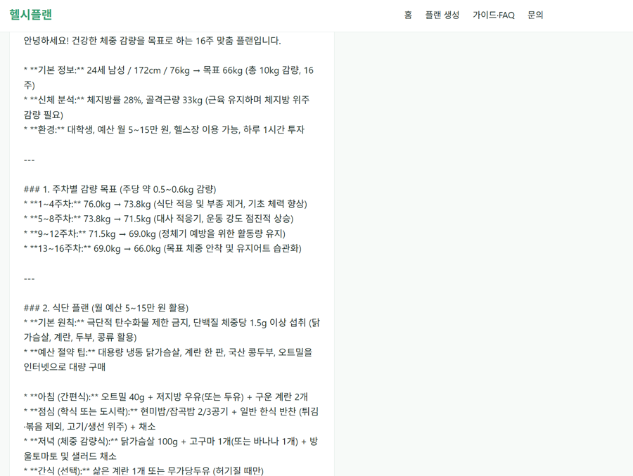
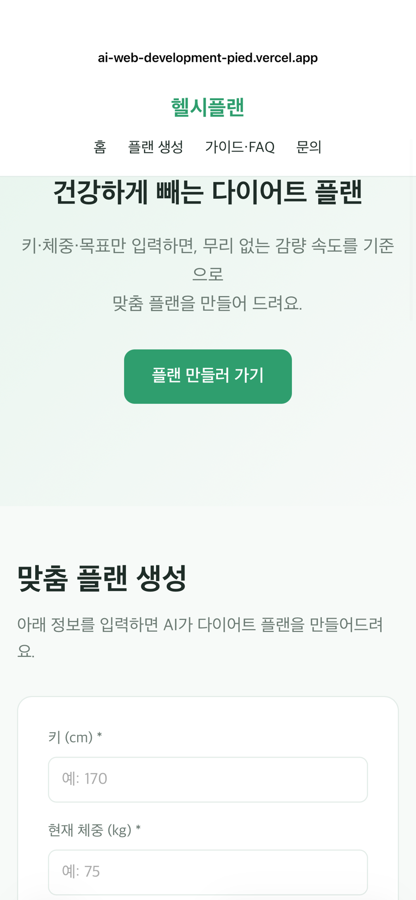

# 헬시플랜 (HealthyPlan)

> 키·체중·목표·기간·예산·생활환경을 입력하면, **건강한 감량 속도를 기준으로** AI가 맞춤 다이어트 플랜을 만들어주는 웹 서비스

## 🔗 배포 URL
**https://ai-web-development-pied.vercel.app**

---

## 1. 서비스 소개

다이어트를 시작할 때 무리한 목표를 세우기 쉽습니다. 헬시플랜은 사용자의 신체 정보와 생활 환경을 입력받아, **의학적으로 권장되는 안전한 감량 속도(주당 체중의 0.5~1%)를 기준으로** AI가 현실적인 다이어트 플랜을 생성합니다.

- **타겟 사용자**: 다이어트를 시작하려는 직장인·학생, 인바디 없이 방향을 잡고 싶은 사람, 예산·시간이 제한적인 사람
- **차별점**: 인바디가 없어도 키·체중만으로 시작 가능하며, 무리한 목표는 자동으로 경고하여 건강한 다이어트를 유도

---

## 2. 페이지 구성 (4개 섹션)

상단 네비게이션으로 이동하는 싱글 페이지 구조이며, 모바일·태블릿·데스크톱 반응형으로 구현했습니다.

| 섹션 | 내용 |
|------|------|
| **홈 (Hero)** | 서비스 소개와 시작 버튼 |
| **플랜 생성 (AI)** | 정보 입력 폼 → AI 맞춤 플랜 출력 (핵심 기능) |
| **가이드·FAQ** | 건강한 감량 원칙과 자주 묻는 질문 |
| **문의하기** | 간단 문의 폼 |

---

## 3. 핵심 기능: AI 맞춤 플랜 생성

### 입력 항목
- **필수**: 키(cm), 현재 체중(kg), 목표 체중(kg), 목표 기간(주)
- **선택**: 나이, 성별, 인바디(체지방률·골격근량)
- **선택(클릭)**: 직업, 하루 가용 시간, 월 예산, 운동 환경(헬스장/홈트)

### 처리 및 출력
1. 키·체중 입력 시 **BMI 실시간 계산** 및 표시
2. **안전장치** — 목표 BMI가 저체중(18.5 미만)이거나, 감량 속도가 주당 체중의 1%를 초과하면 경고하고 진행 차단
3. 검증 통과 시 AI가 **주차별 감량 목표 → 예산 반영 식단 → 환경 반영 운동 루틴 → 주의사항**을 생성

### 안전 기준 (건강한 감량 원칙)
- 권장 감량 속도: **주당 현재 체중의 0.5~1%**
- 저체중 목표 시 재조정 안내
- 화면에 "의학적 조언이 아닌 참고용" 고지 표시

---

## 4. 기술 스택 및 아키텍처

| 구분 | 사용 기술 |
|------|-----------|
| 프론트엔드 | HTML / CSS / JavaScript (프레임워크 미사용) |
| 백엔드 | Vercel Serverless Functions (Python) |
| AI | Google Gemini API (`gemini-flash-latest`) |
| 배포 · 형상관리 | Vercel · GitHub |

### 데이터 흐름 (입력 → AI 결과)
```
[사용자 입력]
   ↓ (플랜 생성하기 클릭)
[JavaScript] 입력값 수집 → fetch('/api/plan')로 백엔드에 요청
   ↓
[Python 백엔드 api/plan.py] 입력값으로 프롬프트 생성 → Gemini API 호출
   ↓
[Google Gemini] 맞춤 플랜 텍스트 생성
   ↓
[Python 백엔드] 결과를 프론트에 응답(response)으로 반환
   ↓
[JavaScript] 받은 결과를 화면에 표시
```

---

## 5. 프로젝트 구조 및 파일 역할

```
.
├── index.html          # 화면 구조(뼈대) — 4개 섹션, 입력 폼
├── css/style.css       # 디자인 — 색상·레이아웃·반응형(미디어쿼리)
├── js/main.js          # 동작 — BMI 계산, 입력 검증, API 호출, 실패 처리
├── api/plan.py         # 백엔드 — Gemini 호출, 프롬프트 생성, 응답 반환
├── requirements.txt    # Python 패키지 (표준 라이브러리만 사용해 비어 있음)
├── vercel.json         # Vercel 배포 설정
├── .python-version     # Python 버전 지정 (3.12)
└── README.md
```

- **index.html** — 화면에 무엇이 있는지 정의 (제목, 입력칸, 버튼, 섹션)
- **css/style.css** — 그것들을 어떻게 보이게 할지 (색·크기·배치), 화면 크기별 반응형 처리
- **js/main.js** — 사용자와의 상호작용 담당. 입력값을 계산·검증하고, 백엔드에 요청을 보내 결과를 화면에 그림
- **api/plan.py** — 서버 역할. 프론트의 요청을 받아 AI에게 보낼 문장을 만들고, Gemini를 호출한 뒤 결과를 돌려줌

---

## 6. 환경 변수 (보안)

API 키는 **비밀번호와 같아** 코드에 직접 넣지 않고 환경 변수로 관리합니다. 코드에서는 `os.environ.get("GEMINI_API_KEY")`로 불러오며, `.env.local`은 `.gitignore`에 등록되어 GitHub에 올라가지 않습니다.

### 로컬 테스트
프로젝트 루트에 `.env.local` 파일 생성:
```
GEMINI_API_KEY=본인의_Gemini_API_키
```
> Gemini API 키는 Google AI Studio(https://aistudio.google.com/apikey)에서 무료 발급.

### Vercel 배포 시
Settings → Environment Variables → `GEMINI_API_KEY` 등록 → 재배포.

---

## 7. 실패 처리 (예외 상황 안내)

| 상황 | 처리 |
|------|------|
| 빈 입력 (필수값 누락) | "키·체중·목표 체중·기간을 모두 입력해주세요" 안내, 호출 차단 |
| 과도한 감량 목표 | 감량 속도 주당 1% 초과 시 경고 |
| 저체중 목표 | 목표 BMI 18.5 미만 시 조정 안내 |
| API 오류 (4xx/5xx) | 상태 코드와 함께 오류 안내 |
| 응답 지연 | 60초 타임아웃 후 "응답이 지연되고 있어요" 안내 |
| 서버 과부하 (429/503) | 자동 재시도 후에도 실패 시 재시도 안내 |

---

## 8. 배포 방법 (GitHub + Vercel)

1. 저장소를 GitHub에 push
2. vercel.com → New Project → GitHub 저장소 import
3. **Framework Preset을 `Other`로 설정** (프론트+백엔드 혼합 구조 인식을 위해 중요)
4. 환경 변수 `GEMINI_API_KEY` 등록
5. Deploy → 발급된 URL에서 동작 확인

---

## 9. 개발 중 겪은 문제와 해결 (로컬 vs 배포)

- **로컬 실행 문제**: Windows 경로(한글·공백)와 `python3` 인식 문제로 `vercel dev`가 실패 → 배포 환경(Linux)에서는 발생하지 않아, 로컬 테스트 대신 실제 배포로 검증.
- **배포 시 Python 전용 인식 문제**: Vercel이 프로젝트를 Python 앱으로만 인식해 HTML이 서빙되지 않음 → **Framework Preset을 Other로 변경**하여 정적 파일(HTML/CSS/JS)과 백엔드(api/*.py)를 함께 처리하도록 해결.
- **AI API 전환**: 처음엔 OpenAI를 사용하려 했으나 키가 작동하지 않아 **Google Gemini로 전환**. (미션 요구사항 "AI API(OpenAI, Claude 등)"의 범위에 포함)

> 이 과정을 통해 **로컬 환경과 배포 환경의 차이**를 이해하고, 오류의 원인을 파악해 수정하는 흐름을 직접 경험했습니다.

---

## 🖥 스크린샷

### 데스크톱 — 홈


### AI 기능 동작 (맞춤 플랜 생성 결과)


### 모바일 (반응형)


---

## ⚠️ 유의사항
- 본 서비스의 플랜은 **참고용이며 의학적 조언이 아닙니다.**
- API 키 유출 시 즉시 폐기·재발급하고 노출된 커밋 이력을 정리하세요.
- Gemini API는 무료 티어 요청 한도가 있으며, 초과 시 일시적으로 요청이 제한될 수 있습니다.
